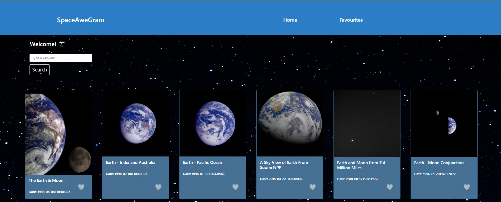
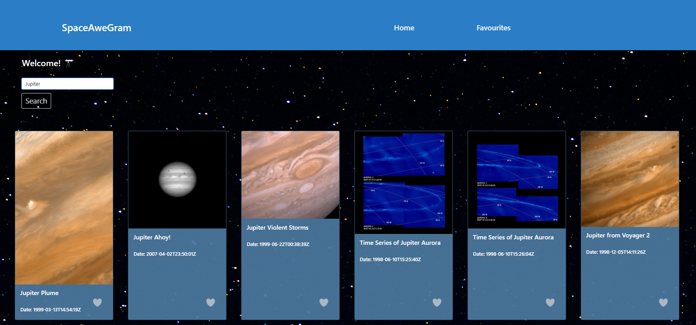
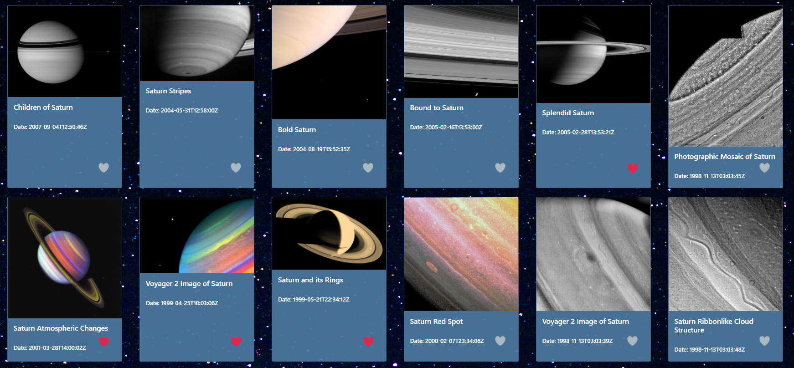
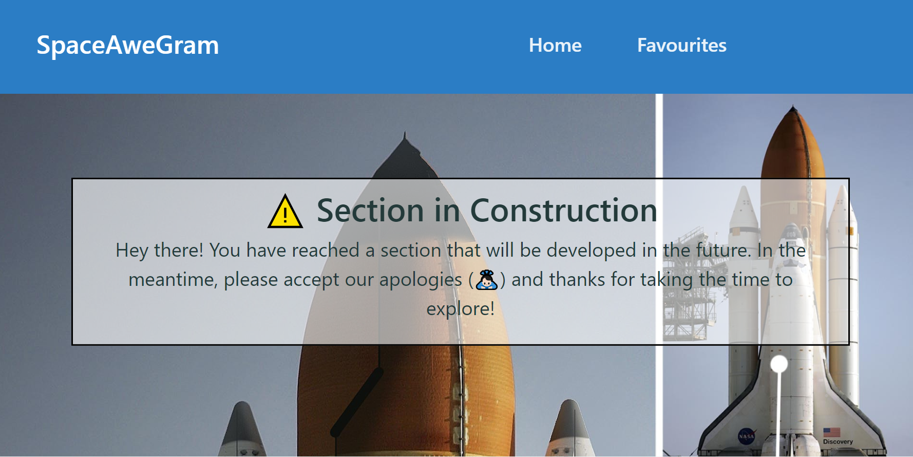

## <SpaceAweGram>

## Table of Contents

  - [Description](#description)
  - [Installation](#installation)
  - [Usage](#usage)
  - [Credits](#credits)
  - [GitHub](#github)
  - [Features](#features)

## Description

This REACT.js application allows the keen space observer to view images from the NASA Video and Image Library. By typing a keyword, the aplication will fetch all related images and display them in cards. The user will be able to like or unlike the images. Currently, no data permanence is implemented. In the future, a possible improvement would be to save liked images into a personal library so that the user can access them easily.

The USER STORY goes as follow

    AS A user
    I WANT an application that will fetch NASA images
    SO THAT I can view them and like them.  

## Installation

No installation is needed. This application is run in a live webpage.

## Usage

To use this application, go to the deployed webpage by followig this link: [Visit the deployed page](https://space-awe-gram.herokuapp.com/)

Once in the landing page, pre-loaded images will be shown. Type a keyword in the search bar and hit enter or click on the search button to fetch related images.

After the cards with images are loaded, the user will be able to like or unlike the images as desired.

In the future, a 'Favourites' section will be developed, where liked images will be displayed and saved. For now, an "In Construction" warning sign is displayed.

.

## Credits

Third-party assets:
- [Bootstrap](https://getbootstrap.com/)
- [Nasa Video and Image Library]()
- [React.js](https://reactjs.org/)
- [npm](https://www.npmjs.com/)
- [npm react-animated-heart](https://www.npmjs.com/package/react-animated-heart)
- [Heroku](https://www.heroku.com/nodejs)

Reference material:
- [w3schools](https://www.w3schools.com/)
- [StackOverflow](https://stackoverflow.com/)
- [Mozilla Developer Network](https://developer.mozilla.org/en-US/)
- [CSS-TRICKS guide to flexbox](https://css-tricks.com/snippets/css/a-guide-to-flexbox/)
  

## GitHub

If you want to know more details, feel free to [visit the repo](https://github.com/aj-pena/SpaceAweGram.git)

## Features

FrontEnd:
- Bootstrap grid, cards
- Third Party API (Nasa Video and Images Library)
- React.JS
- React animation
- CSS and Flexbox